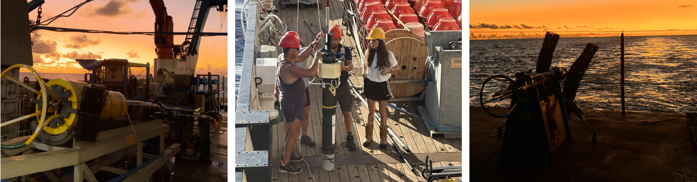
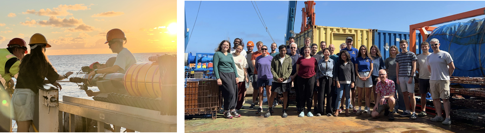

# About me  
:::{#hero-heading}
::: {.left-align}
I am an oceanographer using ocean observations with the aim of understanding how ocean dynamics shape biogeochemistry and phytoplankton in the ocean. 

Currently, I am a postdoctoral fellow in the Physical Oceanography group at the University of Southampton, National Oceanography Centre, learning about mixing. Below, you can read more about my research.
:::

## Interests
:::{.left-align}
* Ocean mixing
* Physical-biological interactions
* Observational oceanography

:::
:::

## Postdoctoral project
::: {.justify-text}
I am part of the [C-Streams (NERC)](https://c-streams.uk/){target="_blank"} and [REMIX-TUNE (ERC)](https://cordis.europa.eu/project/id/101169952){target="_blank"} projects, under supervision of Prof. [Ric Williams](https://www.liverpool.ac.uk/~ric/){target="_blank"} (C-Streams PI), [Dr Bieito Fernández Castro](https://www.southampton.ac.uk/people/5ygpzq/doctor-bieito-fernandez-castro){target="_blank"} and  Prof. [Alberto Naveira Garabato](https://www.southampton.ac.uk/people/5x2hkq/professor-alberto-naveira-garabato){target="_blank"}. C-Streams addresses the role of the North Atlantic in the global carbon cycle as a contribution to one of the World Climate Research Programme Grand Challenges “*Carbon Feedbacks in the Climate System*”. Our task within this project is to understand how mixing processes modify the nutrients and carbon carried by the Gulf Stream as it enters the North Atlantic. REMIX-TUNE project aims to understand how mixing affects ocean ventilation by deploying a fleet of autonomous floats with microstructure sensors. 

During the first year of my postdoctoral stage, we developed a tool to estimate isopycnal stirring and diapycnal mixing from finescale CTD data. The methodology was validated by comparing mixing estimates from Argo float finescale data and direct mixing microstructure observations in the eastern side of the North Atlantic subtropical gyre. This approach allowed us to get, at least, a decade of mixing timeseries. [This work has been published in Journal of Physical Oceanography in February 2026](https://doi.org/10.1175/JPO-D-25-0090.1){target="_blank"}.

Later on, a similar methodology has been applied to investigate the different mixing patterns across the North Atlantic ocean. In this work, we have studied the variance budget of temperature, including the production of variance by mesoscale eddies and microscale turbulence, its transport by currents, and the dissipation of variance by diffusion. [This work has been recently published in Geophysical Research Letters (June 2026)](https://doi.org/10.1029/2026GL122823){target="_blank"}.

In relation to my postdoctoral research, I took part in the CarTRidge oceanographic cruise (2025) on board the RSS James Cook. CarTRidge was a multidisciplinary expedition aiming to test the hypothesis that the mid-Atlantic Ridge serves as a hotspot for carbon export to the deep ocean. To test that idea, we sailed from Rio de Janeiro (Brazil) to Walvis Bay (Namibia) for ~40 days, deploying several instruments regarding physics and biology. In the physics team, we measured turbulence deploying different VMP equipment depending on the target depth (VMP2000 and VMP6000), as well as a novel turbulence float (FloatRider) as part of the REMIX-TUNE and POLEMIX projects. 

CarTRidge project explored how tidal flows over the ridge generate enhanced turbulence, driving nutrients into the euphotic zone and boosting phytoplankton activity. This field experience gave me the opportunity to deepen my understanding of mixing processes and their connection to ocean productivity and the carbon cycle.

:::

## PhD thesis
::: {.justify-text}
Prior to this position, I completed [my PhD](http://hdl.handle.net/11093/7204){target="_blank"} in Oceanography at the University of Vigo, Spain. My PhD topic was related to [thin layers of phytoplankton](https://www.youtube.com/watch?v=YQEJA2p6gzE){target="_blank"} in a highly dynamic coastal upwelling system (Galician Rías, Iberian Peninsula), their characteristics, mechanisms of formation and ecological relevance. I also investigated how [turbulence and stratification](https://youtu.be/2jNNQYyyVgk) patterns are related to the [extraordinary productivity](https://www.youtube.com/watch?v=e8DHxbhwPpI) in that region and their relationship with harmful algal blooms. You can check the presentation [here](thesis_broullon2024.pdf).

During this period, I participated in a few cruises (REMEDIOS-TLP, ECOSUMA) collecting microstructure measurements with the MSS90, which sparked my interest in observing the ocean.

](esquema1.png)

Additionally, throughout my thesis, I have visited different research centres, such as Scripps Institution of Oceanography (host: Peter JS Franks), the University of Liverpool (host: Jonathan Sharples) or NOC Southampton. Some of the contributions to my publications have come out of these insightful visits!

:::

